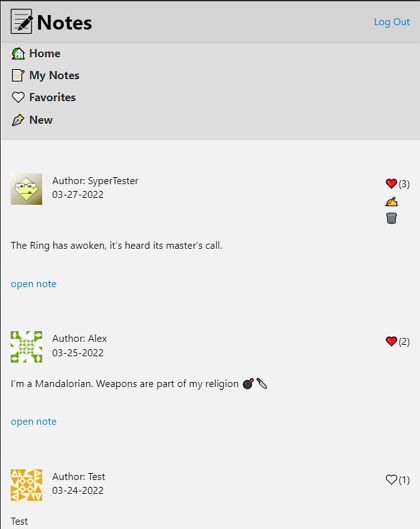

# Notes application

This repository contains front-end code of [Notes application](https://my-simple-note.netlify.app/)

## Online cloud services

Heroku is used for deploying API

Netlify is used for deploying front-end

## Database

MongoDB

# Notes-app
